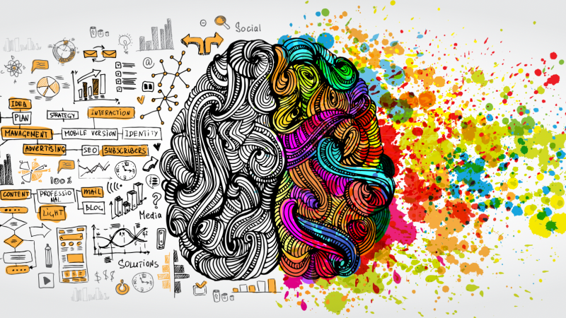

# Project Responsive Web Design using Bootstrap
## Date:25-12-24

## AIM:
To create a simplified clone of Dribbble (https://dribbble.com/) landing page.


## DESIGN STEPS:

### Step 1:
Clone the repository from GitHub.

### Step 2:
Create Django Admin project.

### Step 3:
Create a New App under the Django Admin project.

### Step 4:
Insert the necessary CSS and JavaScript files as external in order to use Bootstrap.

### Step 5:
Create a HTML file and include the needed Bootstrap components.

### Step 6:
Publish the website in the LocalHost.

## PROGRAM :
```
<!DOCTYPE html>
<html lang="en">
<head>
  <meta charset="UTF-8">
  <meta name="viewport" content="width=device-width, initial-scale=1.0">
  <title>Dribbble Clone</title>
  <!-- Link to Bootstrap CSS -->
  <link href="https://stackpath.bootstrapcdn.com/bootstrap/4.5.2/css/bootstrap.min.css" rel="stylesheet">
  <style>
    .hero-section {
      background-color: #ff4081;
      color: white;
      padding: 60px 0;
    }
    .footer {
      background-color: #f1f1f1;
      text-align: center;
      padding: 20px;
    }
  </style>
</head>
<body>

  <!-- Navbar -->
  <nav class="navbar navbar-expand-lg navbar-light bg-light">
    <a class="navbar-brand" href="#">Dribbble Clone</a>
    <button class="navbar-toggler" type="button" data-toggle="collapse" data-target="#navbarNav" aria-controls="navbarNav" aria-expanded="false" aria-label="Toggle navigation">
      <span class="navbar-toggler-icon"></span>
    </button>
    <div class="collapse navbar-collapse" id="navbarNav">
      <ul class="navbar-nav ml-auto">
        <li class="nav-item active">
          <a class="nav-link" href="https://asia.creative.com/">Home</a>
        </li>
        <li class="nav-item">
          <a class="nav-link" href="https://asia.creative.com/p/super-x-fi/creative-sxfi-gamer">Explore</a>
        </li>
        <li class="nav-item">
          <a class="nav-link" href="https://us.creative.com/account/signup?ReturnUrl=%2faccount%2f">Sign In</a>
        </li>
      </ul>
    </div>
  </nav>

  <!-- Hero Section -->
  <section class="hero-section text-center">
    <h1>Welcome to Dribbble Clone</h1>
    <p>Discover creative works and inspiration from designers around the world.</p>
  </section>

  <!-- Content Sections -->
  <div class="container py-5">
    <div class="row">
      <div class="col-md-4">
        <div class="card">
          
          <div class="card-body">
            <h5 class="card-title">Design 1</h5>
            <p class="card-text">A description of a creative design work or project.</p>
          </div>
        </div>
      </div>
      <div class="col-md-4">
        <div class="card">
          
          <div class="card-body">
            <h5 class="card-title">Design 2</h5>
            <p class="card-text">Another description of a design or creative work.</p>
          </div>
        </div>
      </div>
      <div class="col-md-4">
        <div class="card">
          
          <div class="card-body">
            <h5 class="card-title">Design 3</h5>
            <p class="card-text">A third example of a creative project or artwork.</p>
          </div>
        </div>
      </div>
    </div>
  </div>

  <!-- Footer -->
  <footer class="footer">
    <p>&copy; 2024 Developed by Muhammad Aiman[24901053]. All rights reserved.</p>
  </footer>

  <!-- Bootstrap JS and dependencies -->
  <script src="https://code.jquery.com/jquery-3.5.1.slim.min.js"></script>
  <script src="https://cdn.jsdelivr.net/npm/@popperjs/core@2.9.3/dist/umd/popper.min.js"></script>
  <script src="https://stackpath.bootstrapcdn.com/bootstrap/4.5.2/js/bootstrap.min.js"></script>
</body>
</html>
```

## OUTPUT:

.png>)
.png>)
.png>)
.png>)
## RESULT:
The Project for responsive web design using Bootstrap is completed successfully.
